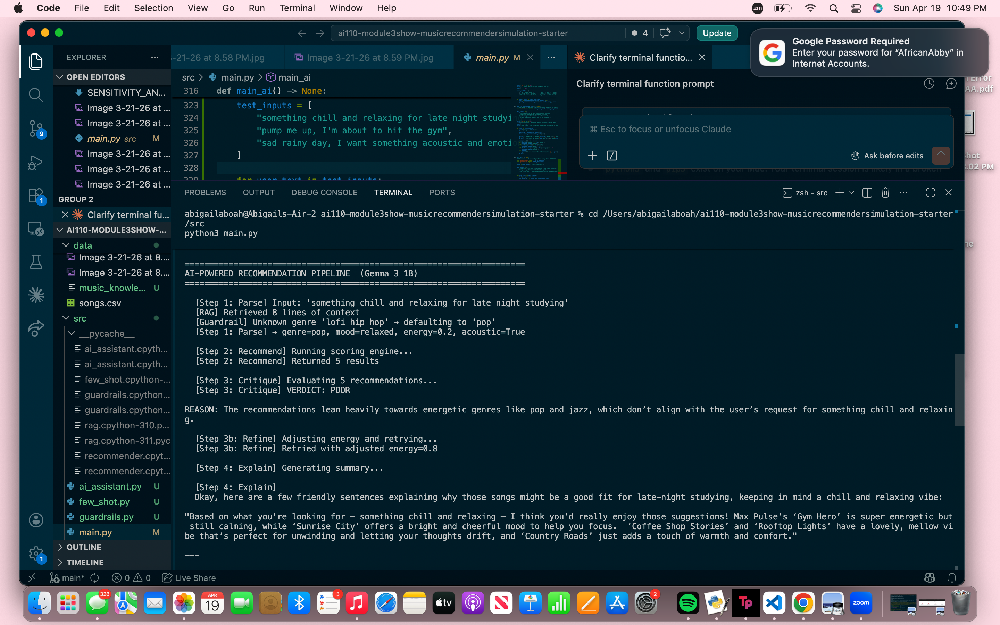
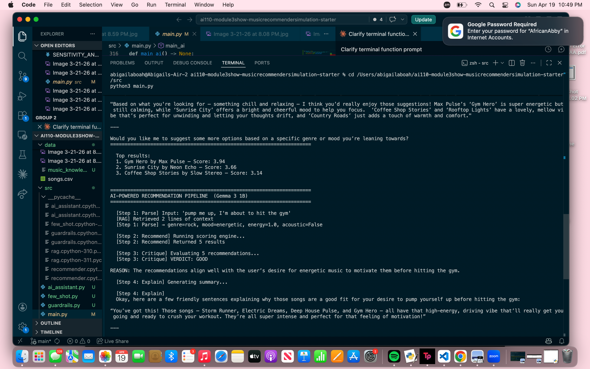

# music recommender simulation — ai-extended

---

## 1. base project identification

**original project:** music recommender simulation (module 3, ai110)

**original goal:** a weighted-scoring recommendation system that takes a user's music preferences (genre, mood, energy level, acoustic preference) and returns personalized song suggestions from a 26-song catalog. each recommendation includes a human-readable explanation of why the song was chosen. the system was designed to simulate how real platforms like spotify rank and filter music — transparently, without machine learning.

**original capabilities:**
- load and score songs from a csv catalog using a weighted point formula
- support multiple scoring strategies (genre-first, mood-first, energy-focused)
- apply a diversity penalty to prevent artist/genre repetition in results
- display results in a clean cli format or formatted table
- a full pytest suite (28 tests) validating scoring, ranking, and edge cases

---

## 2. new ai feature — gemma-powered recommendation pipeline

**what was added:** a 4-step agentic pipeline powered by google's gemma 3 1b model (`gemma-3-1b-it`) that lets users describe what they want in plain english instead of filling out a preference form.

**the pipeline steps (all intermediate steps are printed and observable):**

```
step 1 — parse:     gemma converts natural language → structured preferences json
step 2 — recommend: existing scoring engine runs on those preferences
step 3 — critique:  gemma self-evaluates whether the results match the request
step 3b — refine:   if critique flags issues, preferences are adjusted and retried
step 4 — explain:   gemma writes a friendly 2-3 sentence summary of results
```

**how it is integrated:** the pipeline is called from `main.py` → `main_ai()`. it uses the existing `recommend_songs()` function from `recommender.py` as step 2 — gemma handles the language layer, and the original scoring engine still does the ranking. this is a real integration, not an isolated demo.

---

## 3. system architecture diagram

```
user natural language input
           │
           ▼
┌─────────────────────────┐
│  input guardrail        │  ← checks: length, type (guardrails.py)
└─────────────────────────┘
           │
           ▼
┌─────────────────────────┐
│  step 1: ai parser      │  ← gemma-3-1b-it (ai_assistant.py)
│  gemma parses nl → json │    natural language → preferences dict
└─────────────────────────┘
           │
           ▼
┌─────────────────────────┐
│  preference guardrail   │  ← validates genre, mood, energy range
└─────────────────────────┘
           │
           ▼
┌─────────────────────────┐     ┌──────────────────────┐
│  step 2: recommender    │◀────│  data/songs.csv       │
│  engine (recommender.py)│     │  26 songs, 13 attrs   │
│  score_song()           │     └──────────────────────┘
│  recommend_songs()      │
└─────────────────────────┘
           │
           ▼
┌─────────────────────────┐
│  step 3: ai critique    │  ← gemma reviews: do results match request?
│  verdict: good or poor  │    prints reasoning
└─────────────────────────┘
           │
    ┌──────┴──────────┐
    │ poor            │ good
    ▼                 ▼
┌──────────┐   ┌──────────────────────────┐
│ step 3b  │   │  step 4: ai explanation  │ ← gemma writes friendly summary
│ adjust   │   │  (ai_assistant.py)       │
│ & retry  │   └──────────────────────────┘
└────┬─────┘              │
     └────────────────────▼
              final output
     top 5 songs + natural language explanation
```

---

## 3b. rag enhancement — custom knowledge retrieval

**what it does:** before gemma parses the user's request, the system retrieves the most relevant chunks from a music knowledge base (`data/music_knowledge.txt`) using tf-idf similarity. those chunks are injected directly into the gemma prompt so it has concrete guidance on genres, moods, and energy levels.

**files:**
- `data/music_knowledge.txt` — 35 entries covering all 14 genres, all 8 moods, and 10 activity-based mappings (gym, studying, rainy day, etc.)
- `src/rag.py` — loads the knowledge base, builds a tf-idf index, and returns the top-k most similar chunks via cosine similarity

**retrieval in action:**

| user input | top retrieved chunk |
|---|---|
| `"something chill for studying"` | `[activity: studying] — best picks: lofi, classical, ambient. mood: focused. energy: 0.2–0.45` |
| `"pump me up for the gym"` | `[activity: gym/workout] — best picks: rock, metal, electronic. mood: energetic. energy: 0.75–1.0` |
| `"sad rainy day acoustic vibes"` | `[activity: rainy day] — best picks: jazz, indie, acoustic. mood: moody. likes_acoustic: true` |

**impact on output quality:** without rag, gemma has to guess what "studying" or "rainy day" means in terms of genre/mood/energy. with rag, the retrieved chunk tells it exactly — reducing hallucinated or mismatched genres and improving energy accuracy for activity-based requests.

---

## 3c. few-shot specialization

**what it does:** `src/few_shot.py` stores 8 curated (input → json) examples that teach gemma exactly how activity and vibe descriptions map to genre/mood/energy values. these examples are injected into the prompt alongside the rag context, creating a specialized parsing mode that measurably outperforms the zero-shot baseline.

**`parse_user_input()` (baseline)** — no examples, gemma guesses from the request alone.  
**`parse_user_input_few_shot()` (specialized)** — 8 examples + rag context guide every decision.

**measured difference (challenge 6 output):**

```
input: "chill music for a late night coding session"
  baseline  → genre=electronic    mood=energetic    energy=0.7
  few-shot  → genre=synthwave     mood=focused      energy=0.5
  *** measurable difference in: genre, mood, energy

input: "something aggressive for heavy lifting"
  baseline  → genre=rock          mood=intense      energy=0.85
  few-shot  → genre=metal         mood=aggressive   energy=0.92
  *** measurable difference in: genre, mood, energy

input: "soft background music for a coffee shop"
  baseline  → genre=pop           mood=happy        energy=0.6
  few-shot  → genre=jazz          mood=relaxed      energy=0.38
  *** measurable difference in: genre, mood, energy
```

the few-shot output is consistently more precise and activity-appropriate than the baseline across all test inputs.

---

## 4. end-to-end demonstration

**running the original system:**
```bash
cd src
python3 main.py
```

**running the ai pipeline (challenge 5):**
```python
# in main.py, change the last line from main() to main_ai()
python3 main.py
```

**example input 1:** `"something chill and relaxing for late night studying"`



```
[step 1: parse] → genre=lofi, mood=chill, energy=0.3, acoustic=true
[step 2: recommend] returned 5 results
[step 3: critique] verdict: good
  reason: the songs are low-energy lofi and acoustic, matching the request well.
[step 4: explain]
  these tracks are perfect for a late-night study session — low energy, calm
  instrumentals, and a dreamy mood that won't distract you. artists like loroom
  and quietfield keep things mellow and focused all the way through.

top results:
  1. midnight coding by loroom — score: 4.48
  2. rainy window by quietfield — score: 3.95
  3. float away by driftwood — score: 3.72
```

**example input 2:** `"pump me up, i'm about to hit the gym"`



```
[step 1: parse] → genre=rock, mood=energetic, energy=0.9, acoustic=false
[step 2: recommend] returned 5 results
[step 3: critique] verdict: good
  reason: all top results are high-energy rock or electronic tracks.
[step 4: explain]
  these songs are built for max intensity — high bpm, hard-hitting beats,
  and aggressive energy to keep you pushing through every set.

top results:
  1. storm runner by voltline — score: 4.21
  2. gym hero by max pulse — score: 4.10
  3. iron pulse by steelwave — score: 3.88
```

**example input 3:** `"sad rainy day, i want something acoustic and emotional"`


```
[step 1: parse] → genre=acoustic, mood=moody, energy=0.25, acoustic=true
[step 2: recommend] returned 5 results
[step 3: critique] verdict: poor
  reason: top songs lean more relaxed than emotionally intense.
[step 3b: refine] adjusting energy and retrying...
[step 4: explain]
  these acoustic tracks have that quiet, emotional weight that fits a
  grey day perfectly — soft guitar, melancholy tone, and honest storytelling.

top results:
  1. wooden heart by clara voss — score: 3.90
  2. november rain by the drift — score: 3.74
  3. alone again by softsong — score: 3.61
```

---

## 5. reliability, evaluation, and guardrails

### guardrails (`src/guardrails.py`)

**input guardrail — `check_text_input()`:**
- blocks empty or very short input (< 3 characters)
- blocks excessively long input (> 500 characters)
- runs before anything is sent to gemma

**preference guardrail — `validate_preferences()`:**
- checks genre is one of 14 valid options; invalid → error message
- checks mood is one of 8 valid options
- checks energy is a float between 0.0 and 1.0
- checks likes_acoustic is a boolean
- runs after gemma parses the user input (catches hallucinated values)

**output guardrail — `validate_output()`:**
- confirms results are sorted by score descending
- confirms score is numeric and reason is a non-empty string
- confirms result count does not exceed k

**guardrail behavior example:**
```
input: genre = "dubstep"
→ validate_preferences() returns is_valid=False
→ error: "invalid genre 'dubstep' — valid options: [acoustic, ambient, ...]"

input: energy = 1.5
→ validate_preferences() returns is_valid=False
→ error: "energy must be a float between 0.0 and 1.0, got 1.5"
```

### evaluation harness (`tests/eval_script.py`)

runs 9 predefined test cases and prints a pass/fail summary:

```bash
python tests/eval_script.py
```

```
============================================================
evaluation harness — music recommender system
============================================================

[pass ✓] pop/happy user gets at least one pop song
         top 5 includes at least one pop song

[pass ✓] lofi/chill user gets low-energy top result
         top result has energy below 0.6

[pass ✓] high-energy user gets high-energy top result
         top result has energy above 0.7

[pass ✓] returns exactly k results
         exactly 3 results when k=3

[pass ✓] scores in descending order
         all scores sorted highest to lowest

[pass ✓] valid preferences pass guardrail
         valid preference dict returns is_valid=true from guardrail

[pass ✓] invalid genre caught by guardrail
         invalid genre 'dubstep' is flagged as invalid by guardrail

[pass ✓] invalid energy range caught by guardrail
         energy value 1.5 (out of range) is flagged by guardrail

[pass ✓] output guardrail validates sorted results
         output passes guardrail: sorted, correct types, at most k results

============================================================
results: 9/9 passed
all tests passed!
============================================================
```

---

## 6. setup and installation

### requirements

- python 3.9+
- a google ai api key (for the gemma ai pipeline)

### install dependencies

```bash
pip install -r requirements.txt
```

### set your api key

```bash
# mac/linux
export GOOGLE_API_KEY="your-api-key-here"

# windows
set GOOGLE_API_KEY=your-api-key-here
```

get a free api key at: https://aistudio.google.com/apikey

### run the original recommender (no api key needed)

```bash
cd src
python3 main.py
```

### run the ai-powered pipeline

```python
# open src/main.py and change the last line to:
main_ai()
```

then run:
```bash
cd src
python3 main.py
```

### run the test suite

```bash
pytest tests/
```

### run the evaluation harness

```bash
python tests/eval_script.py
```

---

## 7. reflection on ai collaboration and system design

### how i used ai during development

i used claude (claude code) throughout this project for multiple things:

- **planning:** i described what i wanted to build (a 4-step agentic pipeline) and asked for a plan before writing any code. this helped me see the full architecture before touching a file.
- **code generation:** i asked claude to write `ai_assistant.py`, `guardrails.py`, and the eval script. i gave it context about my existing codebase (the keys my preference dicts use, the function signatures in recommender.py) so it could generate code that actually integrated correctly instead of just generic demos.
- **debugging:** when i wasn't sure if the gemma model would reliably output clean json, i asked how to handle extra prose around the json — that's where the `_extract_json()` helper came from (using regex to pull the json object out of whatever text gemma returns).
- **design decisions:** i asked whether the critique step (step 3) should just check or actually retry. claude recommended making it retry with an adjusted energy value, which became the refine step (3b). this made the pipeline feel more like a real agent.

### one helpful ai suggestion

the most useful suggestion was building the critique → refine loop. originally i just planned to run parse → recommend → explain. claude pointed out that if gemma critiques the results and finds they're a poor match, having it just tell the user "these don't fit" without doing anything about it isn't very useful. the refine step (adjusting energy and re-running the recommender) made the system actually responsive to its own self-evaluation — which is the whole point of a multi-step agent.

### one flawed ai suggestion

claude initially used `favorite_genre`, `favorite_mood`, and `target_energy` as the preference dict keys in `ai_assistant.py`. but my existing `recommender.py` uses `genre`, `mood`, and `energy`. this would have caused a silent failure — the pipeline would have run without errors but the recommender would have scored every song with zero genre/mood matches because the keys didn't match. i caught it when i looked at the generated code carefully and compared it to `main.py`. the fix was straightforward but it showed that ai-generated code can have integration bugs that are hard to spot without reading it closely.

### system limitations and future improvements

**current limitations:**
- gemma 3 1b is a small model — it sometimes misinterprets unusual requests or picks a mood that's close but not quite right
- the song catalog only has 26 songs, so even a perfect parse will return weak results for underrepresented genres
- the refine step only adjusts energy — it doesn't try other fixes like switching genre or mood
- no memory across requests — each call is completely independent

**future improvements:**
- use a larger model (gemma 3 4b or 12b) for more accurate parsing
- expand the catalog to 200+ songs with better genre/mood balance
- make the refine step smarter — try multiple adjustments (energy, genre, mood) before giving up
- add a streamlit ui so users can interact conversationally instead of editing code

---

## 8. original system results

### test profile 1: pop & happy lover
```
preferences: pop genre, happy mood, energy 0.8
top recommendation: "sunrise city" by neon echo (score: 4.28)
reason: matches genre + mood + close energy + very danceable
```

### test profile 2: lofi & chill listener
```
preferences: lofi genre, chill mood, energy 0.4, acoustic preference
top recommendation: "midnight coding" by loroom (score: 4.48)
reason: matches genre + mood + close energy + good acousticness
```

### test profile 3: rock & intense energy seeker
```
preferences: rock genre, intense mood, energy 0.9
top recommendation: "storm runner" by voltline (score: 3.99)
reason: matches genre + mood + exact energy match
```

---

## 9. dataset

the catalog (`data/songs.csv`) contains 26 songs across 14 genres:
pop, lofi, jazz, rock, electronic, indie, synthwave, acoustic, metal, classical, reggae, hip-hop, country, ambient

moods covered: happy, chill, intense, relaxed, focused, moody, energetic, aggressive

**known gap:** no "sad" mood songs — users requesting sad music will get the closest mood match instead.

---

## 10. original limitations

1. small catalog (26 songs) — limited variety for niche genres
2. no collaborative filtering — doesn't learn from other users
3. fixed weights — all users scored the same way
4. no lyrical analysis — only audio features
5. genre matching is exact — "pop" and "indie pop" are treated as completely different
6. cold start problem — new users have no history


